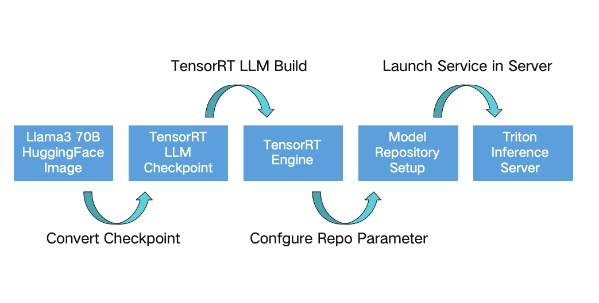

# 推理引擎之 TensorRT-LLM（一）
讲讲整体的工作流(从左到右)

    
    

核心步骤：
* 从训练框架导出的现有模型 checkpoint 并创建 TensorRT-LLM 模型（各模型下 convert_checkpoint.py 脚本）
* 将 TensorRT-LLM 模型构建到 TensorRT-LLM 引擎（trtllm-build 命令）
* 通过 trtllm-serve 命令简单推理或使用 Triton 的 tensorrt-llm backend 进行部署