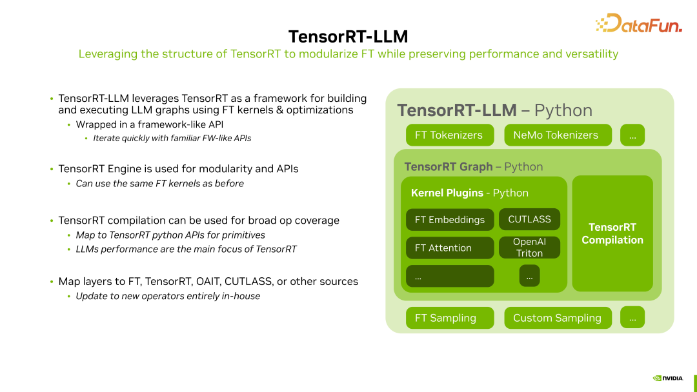
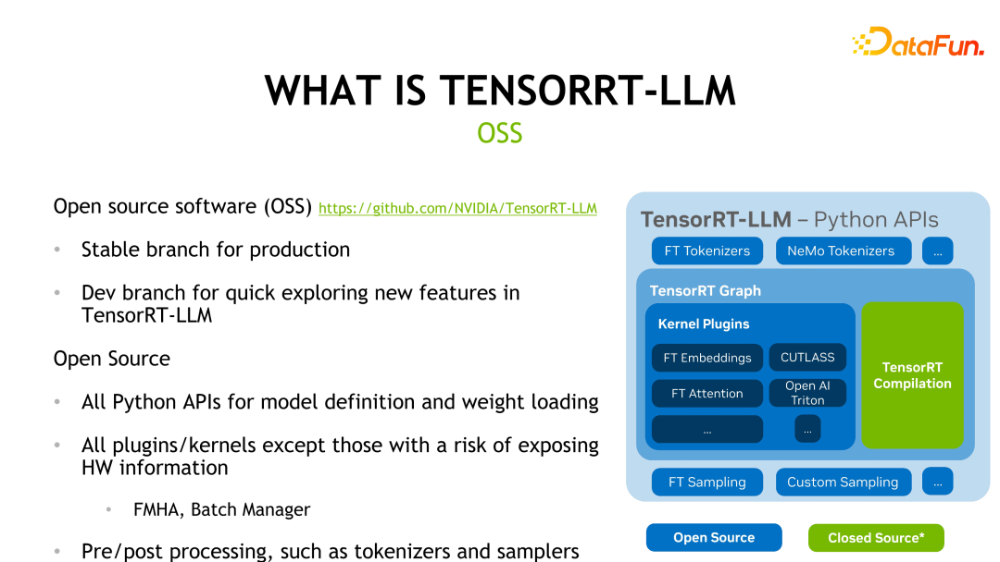

# 推理引擎之 TensorRT-LLM（二）
TensorRT-LLM 内部模块

    
    

由于 TensorRT-LLM 的 Kernel 绝大多数都是从 FT（FastTransformer）中继承来的，因此相对来说 Plugin 优化和自定义性上会比 TensorRT 好做很多，同时 NV 也在做一些 high-level Python SDK 项目
* 比如：https://nvidia.github.io/TensorRT-Incubator/ 里面的 Tripy 模块和 MLIR（与 LLVM 编译相关） 模块

👀：如右侧图所示，目前除了 TensorRT 核心还是闭源的，其余模块都是开源