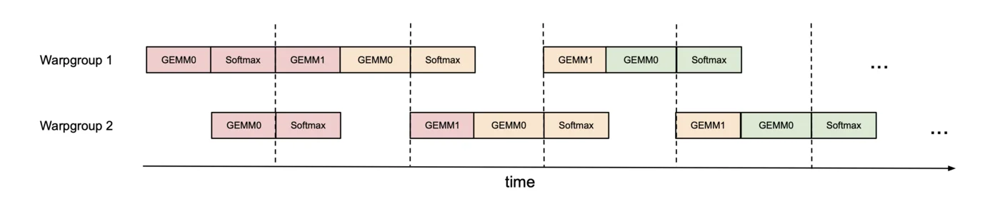
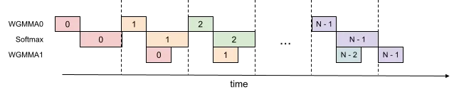

# FlashAttention（十一）
从 FA2 到 FA3（虽然 FA3 还在 beta，但是了解一下也无妨） 分三个方向：WGMMA、TMA、FP8：
* FP8：牺牲一部分精度，换取整体推理吞吐翻倍和耗时的降低（得 Hopper 架构才支持）
* TMA(Tensor Memory Accelerator)：异步加载机制加速全局内存和共享内存之间的数据传输，负责所有索引计算和越界预测。(虽然 A100 在软件上实现了数据异步加载，但是在 H100 上用硬件加速整体异步过程)
* WGMMA(Warp Group Matrix Multiply Accumulate)：基于 TMA 的异步特性执行 MMA 操作。通过新增 4 条 PTX 指令在 Hopper 架构中加速 TensorCore 的批处理能力，让单条指令的计算量更大。
  * PTX(Parallel Thread Execution) 是上承 CUDA C++,下启 GPU 硬件 SASS 指令的一种中间指令语言(NV 的说法叫：低级并行线程执行虚拟机和指令集架构)

    
    

🔑：类比训练中流水线并行的方式，见缝插针执行 GEMM 和 Softmax 操作，最大化压榨 GPU 算力。

<Link to="11">Go to Menu</Link>

<!--
有一部分提升主要是 H100 带来的，具体提升可以参考 H100 的白皮书
-->