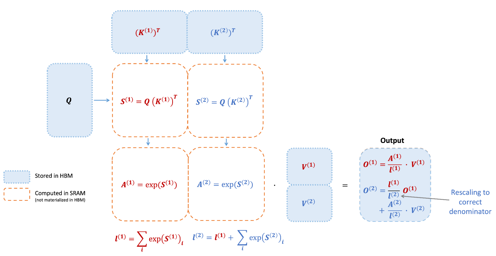

# FlashAttention（四）
Tiling：一种用于减少内存访问延迟并提高计算效率的优化策略; Recomputation：减少内存访问开销的策略

首先将 K 和 V 分成两部分（具体划分根据数据大小和 GPU 特性调整），根据 K1 和 Q 可以计算得到 S1 和 A1，然后结合 V1 得到 O1。
接着计算第二部分，根据 K2 和 Q 可以计算得到 S2 和 A2，然后结合 V2 得到 O2。最后 O2 和 O1 一起得到 Attention 结果。

输入数据 K、Q、V 是存储在 HBM 上的，中间结果 S、A 都不需要存储到 HBM 上。
所以 FA 可以将内存开销降低到线性级别，同时避免了对中间结果的频繁读写，从而提高了计算效率。⭐但还是存在问题！