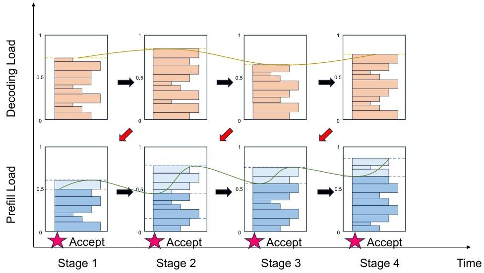

# PD 分离（十）
基于预测的早期拒绝策略，从而降低节点负载的波动

这种策略的核心思想是对一段时间后的 Decoding 节点负载进行预测，并基于预测结果决定是否拒绝请求。

预测可以在请求级别和系统级别两个层面进行，请求级别的预测比较困难，因为要预测单个请求的执行时间；系统级别的预测相对容易一些，只需要预测整体的负载情况。

Mooncake 采用的是一种简化的系统级别预测方法，假设每个请求的执行时间服从某个固定分布，据此预测未来一段时间内的负载情况。

<!--
对于月之暗面的 kimi chat 来说 Mooncake 是非常 adorable 的，毕竟 kimi 的长文本能力是其突出卖点。
-->