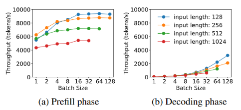

# PD 分离（三）
在 DistServe 的实验中，Batching 策略对两阶段的性能影响显著，但趋势相反：

Batching 策略的独立优化
* Prefill 阶段：吞吐量随 batch size 增加逐渐趋于平稳。这是因为 Prefill 的计算受限特性（compute-bound），当 batch 中的总 token 数超过某个阈值时，计算资源成为瓶颈。
* Decode 阶段：吞吐量随 batch size 增加显著提升。由于 Decode 阶段的存储受限特性（memory-bound），增大 batch size 可提高计算效率，从而显著增加吞吐量。

下图展示了两阶段吞吐量随 batch size 变化的趋势：

