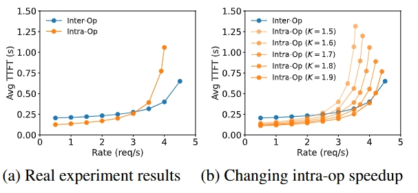
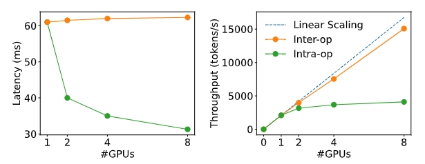

# PD 分离（四）
并行策略优化

在 PD 合并架构中，Prefill 和 Decode 阶段共享相同的并行策略（如数据并行 DP、张量并行 TP 或流水线并行 PP）。但在 PD 分离架构中，可分别为两个阶段选择最优的并行策略。

* Prefill 阶段：在请求率较小时，更适合张量并行。 在请求率较大时，更适合流水线并行。
* Decode 阶段：GPU 数量增加时，流水线并行可显著提高吞吐量（因为其处理方式是流水线化的）。张量并行则可降低延迟（减少单个请求的处理时间）。

    
    

注：intra-op 算子内并行；inter-op 算子间并行；K 是加速系数，反映因算子内并行的高通信开销而导致的不完全加速情况（1 < K < 2）