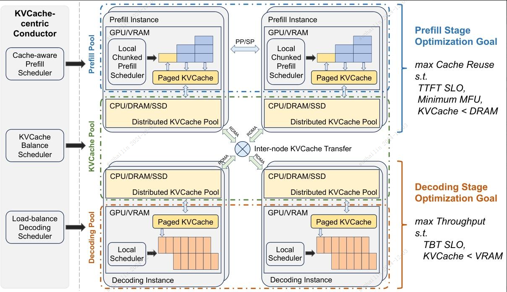

# PD 分离（六）
以月之暗面 Mooncake 为例

Mooncake 的架构是非常典型的分离式架构，将单个同构 GPU 集群的资源打散并重新组织成三个可以独立弹性伸缩的资源池。通过 RDMA 将多节点数据进行串联。

Prefill Pool 处理用户输入，主要对 Time To First Token (TTFT) 负责。同时 Prefill 相对计算密集，这一部分也承担着抬高整体资源利用率的任务。
Prefill 处理完之后对应的 KVCache 会被送到 Decode Pool 进行流式输出。虽然希望尽可能攒大的 batch 以提升 MFU，但这一部分主要需要对 Time Between Tokens (TBT) 负责。

